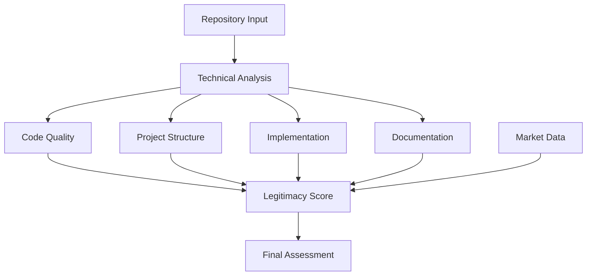
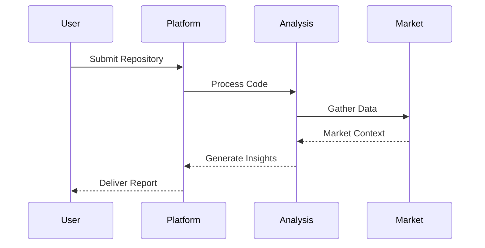

<div align="center">
  
  <h1>AI0x</h1>
  <h3>Market Intelligence Platform for Code Analysis</h3>
<h2>CA: 5M5cPVHs9K1FoNGNgp58dAFzGvU5G5fEADZHXTHwpump</h2>
  <p align="center">
    <a href="https://x.com/ai0xdotfun">
      
    </a>
    <a href="https://discord.gg/sT4aCagN6v">
      
    </a>
    <a href="https://t.me/ai0xportal">
      
    </a>
   
  </p>
</div>

## Overview

AI0x is a real-time market intelligence platform that provides technical assessments and market insights for GitHub repositories. By combining deep code analysis with market sentiment data, we help identify promising technical innovations and potential risks in the rapidly evolving software ecosystem.



## Key Features

### Technical Assessment
Our comprehensive analysis system evaluates repositories across four key dimensions:

<table>
<tr>
<td width="25%">

#### Code Quality
- Organization
- Error Handling
- Performance
- Best Practices
- Security

</td>
<td width="25%">

#### Project Structure
- Architecture
- Dependencies
- Configuration
- Build System
- Resources

</td>
<td width="25%">

#### Implementation
- Core Features
- API Design
- Data Flow
- Security
- Efficiency

</td>
<td width="25%">

#### Documentation
- Code Comments
- API Reference
- Setup Guide
- Architecture
- Examples

</td>
</tr>
</table>

### Market Intelligence



- Technical legitimacy scoring (0-100)
- Risk assessment (Low to Extreme)
- Implementation confidence metrics
- Investment potential rating
- Growth trajectory analysis
- Technical trend detection
- Automated market updates

### Real-time Processing

- Live WebSocket updates
- Queue management system
- Progress tracking
- Market data refreshes
- Social platform integration
- Position monitoring
- Instant notifications

## Architecture

### Technology Stack

<table>
<tr>
<td width="25%">

#### Frontend
- HTML5/CSS3
- JavaScript
- WebSocket
- Mermaid.js
- Marked.js

</td>
<td width="25%">

#### Backend
- Node.js/Express
- Socket.IO
- MongoDB
- Redis
- Bull

</td>
<td width="25%">

#### Analysis
- Claude 3 Sonnet
- Custom Algorithms
- Pattern Detection
- Risk Assessment

</td>
<td width="25%">

#### Integration
- GitHub API
- Discord.js
- Telegraf
- Twitter API
- WebSocket

</td>
</tr>
</table>

## Getting Started

### Prerequisites
- Node.js 16+
- MongoDB
- Redis

### Installation

1. Clone the repository
```bash
git clone https://github.com/ai0x/ai0x.git
cd ai0x
```

2. Install dependencies
```bash
npm install
```

3. Configure environment
```bash
# .env
ANTHROPIC_API_KEY=your_key
GITHUB_TOKEN=your_token
MONGODB_URI=mongodb://localhost/ai0x
REDIS_URL=redis://localhost:6379
PORT=3000

# Social Integration
TWITTER_USERNAME=your_username
TWITTER_PASSWORD=your_password
DISCORD_WEBHOOK=your_webhook
TELEGRAM_BOT_TOKEN=your_token
```

4. Start the server
```bash
# Development
npm run dev

# Production
npm start
```

## API Reference

### Analysis Endpoints
```http
POST /api/analyze
GET  /api/repository/:owner/:repo
GET  /api/recent
GET  /api/analyses
GET  /api/insights
GET  /api/trends
```

### Queue Management
```http
GET  /api/queue-position/:jobId
GET  /api/queue/status
POST /api/cleanup
```

## Security

### Protection Measures
- Secure WebSocket connections
- API authentication
- Rate limiting (Express + Redis)
- Data encryption
- Access control
- Session management

### Risk Management
- Input validation
- Error handling
- Audit logging
- Backup systems
- Continuous monitoring
- Security best practices

## Community

Join our growing community:

- 𝕏 [@ai0xdotfun](https://x.com/ai0xdotfun) - Market updates & alerts
- [Discord](https://discord.gg/sT4aCagN6v) - Technical discussions & bug reports
- [Telegram](https://t.me/ai0xportal) 


## Documentation

For detailed technical information, please refer to our [Technical Whitepaper](public/whitepaper.html).

## Dependencies

```json
{
  "@anthropic-ai/sdk": "^0.14.1",
  "@octokit/rest": "^19.0.13",
  "bull": "^4.16.5",
  "discord.js": "^14.17.2",
  "express": "^4.18.2",
  "ioredis": "^5.4.2",
  "mongoose": "^8.2.0",
  "socket.io": "^4.8.1",
  "telegraf": "^4.16.3"
}
```

## Contributing

We welcome contributions!

## License

This project is licensed under the MIT License 
